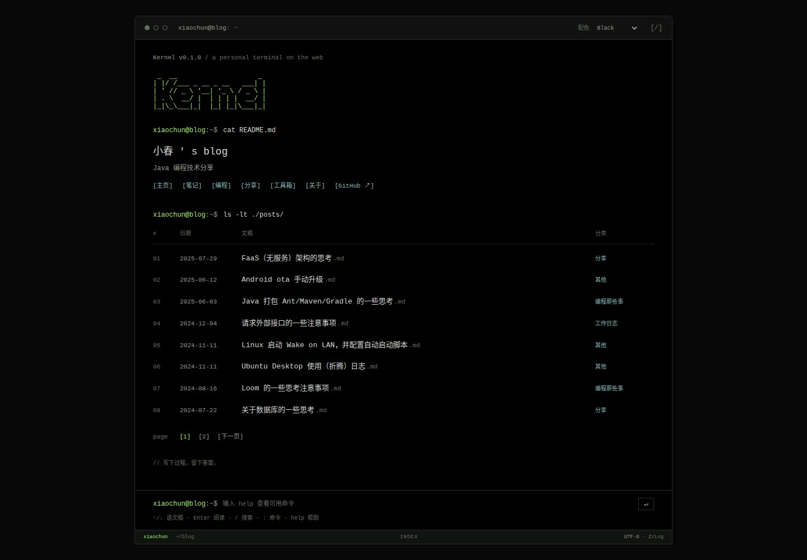

# Kernel

面向 ZrLog 的原创 FreeMarker 终端主题。整个页面是一场连续的 terminal session：短小的会话栏、当前路径、`ls` 文稿输出和可输入的提示符。首页直接呈现文稿目录；打开文章后进入 `less` 风格的单栏阅读，保留适合中文长文的字号、行距和对比度。

默认使用 **black 黑色**，也可在右上选择 `amber`、`dracula`、`nord`，或输入 `theme` 查看、`theme black` 切换。配色保存在 `kernel-theme` Cookie，路径为 `/`、有效期一年、`SameSite=Lax`，HTTPS 页面同时设置 `Secure`。页面在样式加载前读取同一 Cookie，避免恢复配色时闪烁。首次访问和无 JavaScript 时都使用黑色，不跟随操作系统自动变化。

终端会话支持 `help`、`ls`、`ls -lt ./posts/`、`cat 01`、`less 01`、`cat README.md`、`q`、`next`、`prev`、`tags`、`categories`、`archive`、`links`、`cd <分类名>`、`search Java`、`grep Java`、`cd ~`、`clear` 和上下方向键历史。文章编号与 `ls` 仅针对当前页，搜索通过真实服务端执行。命令只处理博客导航、服务端搜索与本地配色偏好，不执行系统 shell 或任意脚本；没有 JavaScript 时仍可使用文章链接与搜索表单。

当前版本 **0.1.0**，已通过官方 ZrLog **3.9.2** 的目录预览和 ZIP 安装验收，并完成桌面／手机终端交互、四套配色、Cookie 恢复与无 JavaScript 回退检查。主题源码由独立仓库 `zrlog-extensions/template-kernel` 维护。目前未发布 Release，也未替换线上主题，`latestRelease` 保持 `null`。

文稿选择、阅读翻屏与命令编辑已通过独立浏览器键盘验收，结果见 `docs/browser-acceptance.json` 的 `keyboard` 字段。



配色预览：[Black](docs/screenshots/desktop-terminal-black.png) · [Amber](docs/screenshots/desktop-terminal-amber.png) · [Dracula](docs/screenshots/desktop-terminal-dracula.png) · [Nord](docs/screenshots/desktop-terminal-nord.png)。另有[手机终端](docs/screenshots/mobile-terminal-black.png)和[单栏阅读](docs/screenshots/desktop-xiaochun-article.png)。

本仓库维护主题源码、设计、配置和版本；[templates](https://github.com/zrlog-extensions/templates) 提供公共规范、Java 构建发布工具、固定预览环境和市场索引。设计与维护规则见 [docs/design.md](docs/design.md) 与 [AGENTS.md](AGENTS.md)。

## 开发与预览

需要 **JDK 17+、Git、Bash 和 curl**。公共工具使用 Maven Wrapper；首次构建与预览需要下载 Maven 依赖和固定运行时。主题没有前端构建步骤，修改 JavaScript 时使用 Node 检查语法。

在本主题根目录执行。已有同级 `templates` 时跳过克隆；如该目录正在进行其他工作，应在独立工具检出中使用下列固定提交：

```bash
git clone https://github.com/zrlog-extensions/templates.git ../templates
git -C ../templates checkout fa397df332576b9dd798ac59a40d4ba96b3266a7
(cd ../templates && ./mvnw verify)
../templates/bin/theme descriptor-check theme.json
../templates/bin/theme check .
../templates/bin/theme preview . --port 7080
```

打开 **http://127.0.0.1:7080**。预览使用经 SHA-256 校验的官方 ZrLog **3.9.2** 和本地 SQLite，加载固定文章与导航数据。修改 FTL、CSS、JS 后刷新；配置、语言与元信息变更后重启。按 Ctrl+C 结束并清理临时预览。

README、[toolkit.lock.json](toolkit.lock.json) 和 [CI](.github/workflows/theme.yml) 使用同一个固定工具提交。升级时同步修改并重新验收。公共字段与文件约定见 [主题契约](https://github.com/zrlog-extensions/templates/blob/fa397df332576b9dd798ac59a40d4ba96b3266a7/docs/theme-contract.md)。

## 键盘操作

以下键位已通过浏览器验收。桌面打开页面后焦点落在主阅读区，可直接选择文稿；手机不自动弹出软键盘。文件链接、搜索与正常焦点导航始终保留。

| 场景 | 键位 | 行为 |
| --- | --- | --- |
| 文章列表 | `↑` / `↓`、`k` / `j` | 选择当前页真实文稿，`Enter` 通过原生链接打开 |
| 主阅读区 | `/`、`:` | 分别进入搜索与命令输入 |
| 阅读文章 | `↑` / `↓`、`k` / `j` | 上下滚动正文 |
| 阅读文章 | `Space` / `Shift+Space`、`PageDown` / `PageUp` | 向后／向前翻屏；`Home` / `End` 到首尾 |
| 阅读文章 | `q` | 返回文稿目录 |
| 命令输入 | `↑` / `↓` | 候选打开时选择候选；关闭时浏览历史 |
| 非空命令输入 | `Tab`、`↑↓`、`Enter` | 输入即显示候选，方向键选择，Tab 或 Enter 接受；空输入的 `Tab` 与 `Shift+Tab` 仍正常移动焦点 |
| 命令输入 | `Ctrl+U`、`Ctrl+K` | 清空输入、删除光标后的文字 |
| 输入取消 | `Esc`、无选区时 `Ctrl+C` | Esc 先关闭候选，再按取消输入；Ctrl+C 取消输入，有选区时保留复制 |

文本输入和中文输入法组合期间不触发全局单字快捷键。`Ctrl+A` 的全选和浏览器 `Ctrl/Cmd+L`、`R`、`T`、`W` 保持原有行为。

## 主题配置

配置定义在 [setting/config-form.json](setting/config-form.json)。所有个人介绍和链接均来自实际配置；主题不生成技能等级、在线状态、运行时长等虚构指标。

| 配置 | 用途与默认行为 |
| --- | --- |
| `terminalUser` | 提示符中的用户名，默认 `user`；是显示文本，不是系统账户 |
| `terminalHost` | 提示符中的主机显示名，默认 `blog`；不作为路由或真实主机地址 |
| `introTitle` | README 输出中的小标题；留空使用站点名称 `webs.title` |
| `introText` | 首页说明；留空时依次使用站点副标题 `webs.second_title`、站点描述与默认文案 |
| `profileText` | 作者自述，留空时不显示额外介绍 |
| `githubUrl` | 可选 GitHub 链接，仅接受 `https://` 地址；留空时隐藏 |
| `footerText` | 页脚短句，留空时使用双语默认文案 |

[examples/xiaochun-settings.json](examples/xiaochun-settings.json) 用于 `xiaochun.zrlog.com` 的本地配置预览，用户名为 `xiaochun`，GitHub 链接来自该站公开信息，说明留空以沿用站点副标题。

```bash
../templates/bin/theme preview . --settings examples/xiaochun-settings.json --port 7080
```

此命令仍使用公共示例文章，不会连接生产站点。还可分别运行 `--empty` 或 `--comments empty` 检查无文章、无评论的页面。默认评论只验证布局，不验证实际评论插件提交。

## 构建与验收

在主题根目录执行：

```bash
../templates/bin/theme descriptor-check theme.json
../templates/bin/theme check .
for script in js/*.js; do node --check "$script"; done
bash bin/package.sh
bash ../templates/bin/verify-preview.sh . 17094 template-kernel
```

构建生成 `dist/template-kernel.zip` 和 `.zip.sha256`，ZIP 根目录直接包含 `template.properties`，仅打包运行文件。`bin/package.sh` 默认使用同级 `templates`；工具位于其他目录时，通过 `ZRLOG_TEMPLATES_DIR` 指定。

验收脚本检查源码目录和经过真实 ZrLog 安装器安装的 ZIP，结果保存在 `../templates/target/preview-check/template-kernel/`。还需在桌面与手机检查分类、标签、归档、搜索、分页、缺失文章、长标题、无图文章、代码、表格与公式，以及键盘操作、JavaScript 禁用、减少动画和横向溢出。已有结果见 [浏览器验收](docs/browser-acceptance.json) 与 [目录／ZIP 验收](docs/runtime-acceptance.json)：新增键位前的终端版本完成了 38 项浏览器场景及 Cookie 首次绘制、无 JavaScript 检查；旧两栏布局截图已移除。本次新增键盘操作已独立复验：焦点、文稿选择、阅读翻屏、补全、输入法组合事件防护以及浏览器快捷键保留均通过。

数学公式使用主题打包的 KaTeX 0.16.22 样式与 WOFF2 字体，配合编辑器已有公式 HTML，不加入浏览器端公式渲染器。来源与许可证见 [第三方资源说明](docs/third-party.md)。

小春站点真实公开内容的本地预览与限制见 [内容来源说明](docs/preview-content.md)。用户全文和图片只保留在临时预览目录，不随安装包发布。

安装到实际站点前保存当前主题名称与配置。使用已配置的 `zrlogctl theme upload dist/template-kernel.zip` 上传，再到后台主题中心启用；上传与启用是两个操作。生产站点还需检查真实内容和评论插件。

## 发布与市场索引

普通 `main` push 和 PR 调用公共 workflow 构建及目录／ZIP 验收；推送 `v<version>` tag 才调用公共 Java 发布器，上传 ZIP、SHA-256 和含真实下载信息的 `theme.json`。

以当前 `version=0.1.0` 为例，先生成可审阅的发布文件：

```bash
../templates/bin/theme publish . --tag v0.1.0 --output-dir dist --dry-run
```

`--dry-run` 不上传，不代表已发布。建立远端、完成验收并提交源码后，可通过下列 tag 触发正式发布：

```bash
git tag v0.1.0
git push origin v0.1.0
```

tag 去掉 `v` 后须与 `template.properties` 中的版本完全一致。发布成功后，在 `templates/catalog.sources.json` 登记稳定配置地址 `https://github.com/zrlog-extensions/template-kernel/releases/latest/download/theme.json`；索引只同步配置，不拉源码或 ZIP。未发布时可登记源码配置，但不得提供安装地址。`zrlog-www` 通过公共市场清单获取主题介绍与发布状态。

也可自行维护 Release，具体遵循 [发布与市场契约](https://github.com/zrlog-extensions/templates/blob/fa397df332576b9dd798ac59a40d4ba96b3266a7/docs/publication-and-market.md)。

### 服务端跳转后的会话恢复

通过当前标签页的 `sessionStorage` 保存选中文稿、列表路径、滚动位置、命令历史及未提交草稿。分页、目录等命令引起的服务端跳转后，桌面恢复提示符焦点；`open`、`cat`、`less` 打开文章时则聚焦阅读区，方向键与空格立即可用；已提交命令不重复填入。键盘打开文章后进入阅读区，`q` 返回原列表并恢复选中项。刷新恢复草稿与阅读位置，带锚点的链接保留原生定位。手机不自动聚焦输入框，存储不可用时仍保留正常服务端导航。状态仅用于本标签页交互，不提交到服务端。

桌面终端窗口最大宽度为 960px，居中显示；手机继续使用完整可用宽度。文章与文件列表共用这一宽度边界。

页面通过 `script#kernel-data` 输出公开的分类、标签、归档、友链及当前页文章 JSON，自动补全直接读取这些数据。可尝试 `cat Java` 查找文稿候选，或输入 `tags `、`archive ` 选择目标目录；选择候选只填入命令，再按 Enter 才执行。数据结构见 [设计说明](docs/design.md#页面数据与补全)。

选中文稿后输入 `open` 即可打开当前选中项，无需编号；没有选中项时提示先选择，不会随意打开第一篇。`open` 也支持命令名自动补全。

主题运行文件不包含示例站点域名、文章内容或作者账户。站点名称、说明与文稿目录来自 ZrLog，提示符身份和个人链接来自主题配置。`examples/` 与 `docs/` 仅供预览和维护，不进入安装包。主题品牌、命令词、默认配色以及经校验的工具版本属于主题自身定义。
